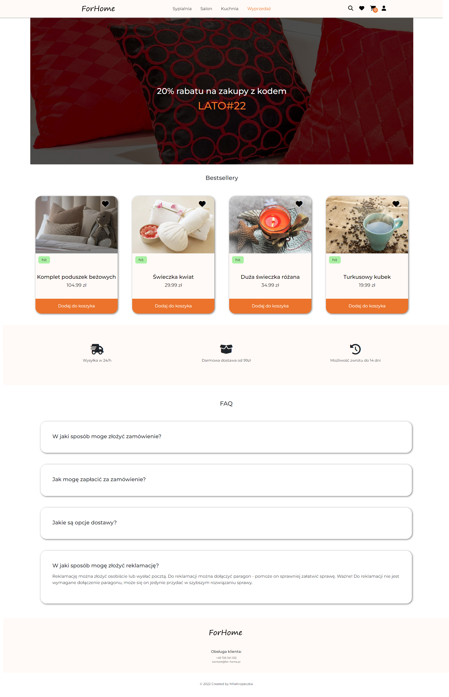

# ForHome - Shop Online

## Description
### Main functions of the project
*** in progress **
## Technologies
         
## I recommend to checking out my other project as well
*** in progress **
## Installation
    git clone https://github.com/MilaKropeczka/ForHome-Shop-Online.git
    npm install
    npm run start
## Solutions
*** in progress **
## Further developments
*** in progress **
## Contact - Write to me if you have any question
*** in progress **
